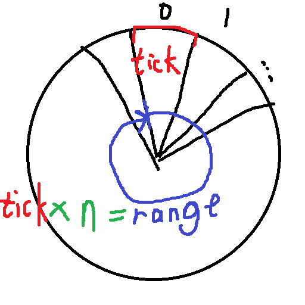

## 情形

TCP 中要求对所有的，已发送但未收到确认的 IP 包，判断它是否超时。

按照字面意思去实现：在**主循环体**中，对**每一个**包，判断`当前时间`是否超过发送时设定的`到期时间`。时间复杂度被我判断为`O(n)`，效率很低。

尝试作优化：设置变量`最早到期时间`，每次循环仅判断`当前时间`是否超过`最早到期时间`。当条件成立时，依次对每一个包进行超时判断。找到这个包的时间复杂度在极限情况下同样被我认为是`O(n)`。

这是典型的需要处理大量定时任务的场景。以上两种都是比较低效的做法。

## 试作算法

我根据经验，试作优化更好的算法：令一个列表按每个包的`到期时间`升序存储数据。每次循环判断第一个包是否超时。当第一个包超时，即可将其推出并判断第二个包是否超时。这样找到超时所在的包的时间复杂度变成了`O(1)`。但维持列表有序地插入的时间复杂度不是`O(1)`。使用二分查找，时间复杂度被降为`O(log(n))`。

## 时间轮

TCP 中实际使用**时间轮**来优化此类任务。它在每次判断是否达到定时时间时的时间复杂度为`O(1)`，插入定时任务时的时间复杂度同样为`O(1)`，十分高效。



时间轮在底层使用 `wheelSize` 个桶用于存放数据。

时间轮运行时，每过一个 `tick` 的时长，指针会移动到下一个桶中。桶中存有定时在它所代表的 `tick` 内的所有任务。

插入任务时，只需用超时时间计算得出任务所属的 `tick` 的位置，即可找到应当放入数据的桶。

时间轮的指针可以随时间推进而一直前进。
当到达原点后会开启新的一轮。
因此，时间轮中相对当前时间设定定时任务的范围是有限的，不能超过 `tick * wheelSize`，否则将过早执行。

提高 `tick` 值会使粒度下降。
提高 `wheelSize` 值会更多地占用空间。
但是实际情况中，在更大的时间跨度下，往往不需要过大的精度。
需求精度的情况往往只需很小的时间范围。
例如 TCP 中，根据 RFC 6298，超时间隔 RTO 必须有上限，建议的上限为 60s。

## Java 中对时间轮的实现

类 `io.netty.util.HashedWheelTimer` 通过时间轮实现了接口 `io.netty.util.Timer`。

它的典型构造函数如下：

```java
public HashedWheelTimer(ThreadFactory threadFactory, long tickDuration, TimeUnit unit, int ticksPerWheel)
```
形参|含义
-|-
`threadFactory`|生产 `HashedWheelTimer` 所用主循环的运行所在线程的工厂函数
`tickDuration`|每个 tick 的时长
`tickerPerWheel`|wheel 大小
`unit`|时间单位
---
安装 `io.netty.util`：[Maven 或 Gradle 项目](https://mvnrepository.com/artifact/io.netty/netty-common)
